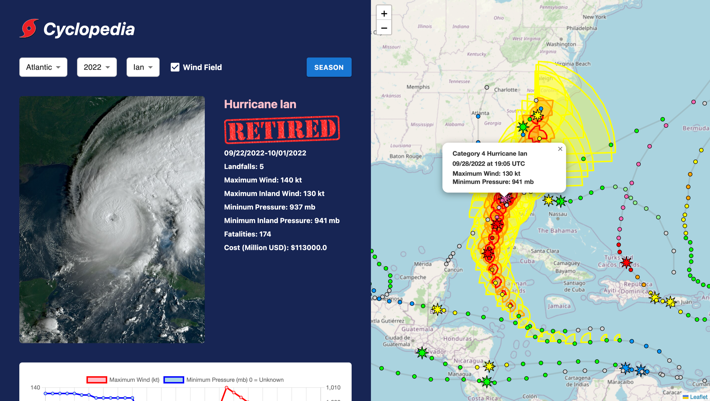

# Cyclopedia

## Table of Contents
- [Description](#description)
- [Installation](#installation)
- [Node Packages](#node-packages)
- [License](#license)

## Description
A web application that displays data on tropical cyclone activity in the Atlantic basin since 1851, fetched from the [Atlantic Hurricane Database](https://github.com/mikematics22800/Atlantic-Hurricane-Database) I created. An interactive map displays detailed track information for every tropical cyclone recorded each year, along with charts which display various statistics for each storm individually and the year cumulatively.

[](https://mikematics22800.github.io/Cyclopedia)

## Installation

```bash
# Navigate to your desired directory
cd path/to/your/desired/directory
# Clone the repository
git clone https://github.com/mikematics22800/Cyclopedia
# Enter the project directory
cd Cyclopedia
# Install dependencies
npm i
# Start the development server
npm run dev
```
After starting the development server, open http://localhost:5174/Cyclopedia in your browser to view the application.

## Node Packages
React | React Router | Vite | Tailwind CSS | Material UI | Chart.js 

## License
[](https://opensource.org/licenses/ISC)
